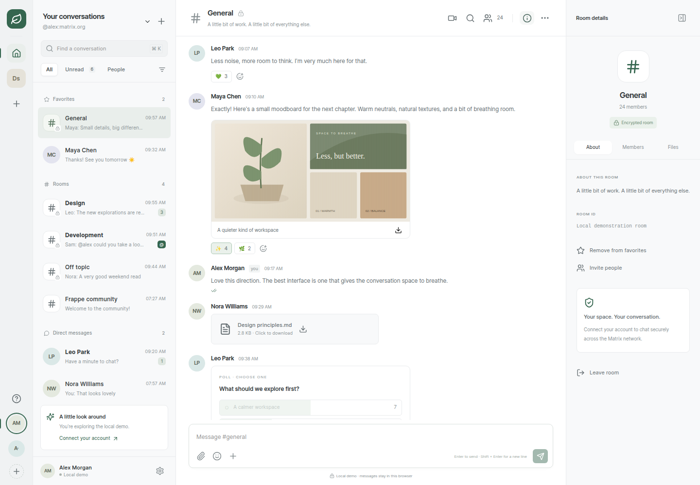

# Fern

A calm, responsive, multi-account Matrix client built with Vue 3, Frappe UI, and the Matrix Rust SDK compiled to WebAssembly. Its account rail and space navigation take inspiration from Cinny. The browser SDK integration follows Element HQ's Aurora experiment.

**[Open Fern](https://hanthor.github.io/fern-matrix/) · [Source](https://github.com/hanthor/fern-matrix) · [Roadmap](https://github.com/hanthor/fern-matrix/issues/2)**

**Get Fern:** [Android APK](https://github.com/hanthor/fern-matrix/releases/latest/download/app-universal-release.apk) · [Linux builds and everything else](https://github.com/hanthor/fern-matrix/releases/latest) (testing-signed — see Install before trusting or redistributing)



Fern is an early implementation, **not a finished Element X replacement**. The interactive local demo works without credentials. Live messaging uses the Rust SDK; there is no Matrix JavaScript SDK fallback. Core login, sync and messaging adapters are tested against disposable Synapse with two browser clients. Independent encryption interoperability and calling/verification flows still need validation with other clients.

## Run

Requires Node 24 (or Node >=20.19).

```sh
npm ci
npm run dev
```

Open http://localhost:5173. The default view prompts you to connect an account or create one (the tour demo lives on the hosted instance, or run with `VITE_FERN_DEMO=1 npm run dev` / `?demo=1`). The homeserver must support password authentication and native sliding sync. Multiple accounts sync independently and use separate IndexedDB stores.

```sh
npm test
npm run test:e2e
npm run build
npm run preview
```

Browser tests use Playwright's installed Chromium, or `FERN_CHROMIUM_PATH` when supplied. For a new machine, run `npx playwright install chromium`. `docs/DEVELOPMENT.md` describes the tests and architecture. The [live integration guide](docs/INTEGRATION.md) explains the disposable Synapse environment and `npm run test:integration`.

## Install

[v0.1.0](https://github.com/hanthor/fern-matrix/releases/tag/v0.1.0) ships signed Linux (deb, AppImage with auto-update) and Android (APK, AAB) builds from CI. Releases are cut by pushing a version tag — `node scripts/cut-release.mjs 0.1.0` sync-checks `package.json`, `src-tauri/tauri.conf.json` and `src-tauri/Cargo.toml` first — which drives the signed desktop and mobile pipelines (see `docs/NATIVE.md`).

**Testing signatures.** This release is signed with testing-only keys so the pipelines run end to end: a local minisign keypair for the desktop updater and an upload keystore for Android, held as CI secrets. They prove the mechanism, not a trust chain — rotate every key and secret before any production release or store upload.

## Implemented

| Area | Behavior |
| --- | --- |
| Responsive UI | Desktop account rail, room sidebar, timeline and details; phone room list / conversation / details views |
| Accounts | Password login, saved sessions, restoration, switching, logout, token refresh delegate, separate encrypted IndexedDB stores |
| Conversations | Native sliding sync, SDK room-list observation, room hierarchy, unread badges, favorites, invitations, room creation, DMs, joining and leaving |
| Messaging | SDK timeline diffs, text, local echoes, history pagination, drafts, replies, edits, redaction, reactions, typing and read receipts |
| Media | Encrypted file upload and SDK media download/decryption; image previews for loaded files |
| Polls | Creation, single-choice voting and results |
| Discovery | Public homeserver room search and pagination; room / person quick switch; loaded-message search |
| Room details | Topic, room ID, members, shared files and invitations |
| Security | Device information, fingerprints, existing-key recovery, new recovery setup when no backup exists, emoji / number device verification |
| Calling | Preloaded Element Call driven through the Rust SDK widget driver: Fern's lobby is the single prescreen, host join on first widget traffic, constrained capabilities and checked postMessage origin/source; requires MatrixRTC infrastructure, live media validation pending |
| Preferences | Light / dark / system appearance, Fern/Ocean/Clay/Ochre accent themes, compact messages, display name editing, persistent English/German language preference |
| Notifications | Browser notifications for the selected room while the app is open; per-room and per-account rules, quiet accounts |
| Installation | Web app manifest, app icons, versioned offline shell; SDK WASM cached after first use; signed Linux deb/AppImage and Android APK/AAB from CI releases |
| Localization | English plus German catalogs across login, composer, timeline, sidebar, search, room details, settings and dialogs (toasts and some screens still English); no RTL yet |
| Hosting | GitHub Pages workflow and nginx container configuration |

## Still to implement

Incoming-call ringing and call-state routing; live two-party/group call media validation with a second client; background push; second-homeserver (Spindle) interop; RTL layouts and remaining English-only surfaces; independent security review; mobile lifecycle, background execution and store distribution; hardware-backed biometric unlock; external-IdP end-to-end login. See [the feature checklist](docs/FEATURES.md), [versioned parity inventory](docs/PARITY.md), and [milestone roadmap](https://github.com/hanthor/fern-matrix/issues/2).

Do not use the demo as evidence of live federation, encryption interoperability, or call media delivery. The demo browser suite verifies local UI behavior and actual WASM initialization. The separate live suite verifies core SDK adapters against a pinned Synapse server; encrypted messaging and calls remain separate validation gates.

## Hosting and Pages

`main` deploys with `.github/workflows/pages.yml`. Pages builds set the Vite base path from GitHub's Pages metadata. Hash routing avoids server rewrite requirements. The build rewrites the manifest and service worker for the same base path.

```sh
FERN_BASE_PATH=/fern-matrix/ npm run build
FERN_BASE_PATH=/fern-matrix/ npm run preview
```

For another repository name, the Actions workflow derives the path automatically. Serve `dist/` over HTTPS. `application/wasm` MIME type is required. The WASM asset is about 51 MB uncompressed and loaded only when a real account needs it; compression is strongly recommended. The entire source tree fits GitHub's normal file limit without LFS.

For a dedicated origin:

```sh
docker build -t fern-matrix .
docker run --rm -p 8080:80 fern-matrix
```

Set `VITE_ELEMENT_CALL_URL` at build time for a self-hosted calling service and update nginx's `frame-src` policy accordingly. The default calling service is `https://call.element.io`. See [Element Call's hosting requirements](https://github.com/element-hq/element-call/blob/main/docs/self_hosting.md).

## Local data

Messages and crypto keys are stored by the SDK in account-specific IndexedDB databases (`fern-<account>`). Browser session credentials and the IndexedDB passphrase live in origin-local storage (`fern.sessions.v1`) to support restoration, alongside per-room drafts (`fern.draft.<account>/…`).

**Threat model.** Browser storage is convenient, not a vault: anything that can run script on this origin (XSS in any app sharing the origin, a malicious extension with page access, or anyone with access to the unlocked browser profile) can read sessions, passphrases and drafts. The passphrase encrypts the IndexedDB store at rest against offline disk inspection only. Mitigations in this design: per-account databases and key prefixes so one account's removal cannot touch another's; no credentials in URLs, logs, screenshots, traces or diagnostics; the service worker caches only versioned public app assets and never Matrix API responses, media or tokens; logout/removal stops sync listeners and timers so stale callbacks cannot resurrect a removed session, and session-restore requests for removed accounts are refused by the keychain delegate. Use a dedicated trusted origin for sensitive accounts; GitHub project Pages share an origin with your other project sites.

**Device and key-sharing policy.** Live megolm sessions are shared with member devices as they join (verified or not), so a new device reads post-join traffic immediately; trust gates only the authenticity shields, never delivery. Superseded sessions after rotation are never pushed and key requests from unverified devices go unanswered, same-user or cross-user — both pinned live. The backstop for a wiped device is the encrypted server backup: setup refuses when a backup exists, reset is explicit with consequences, the old key stops working after rotation, and the new backup re-uploads known keys so migration loses no history. Cross-user verification needs user-verification bindings the SDK build does not expose, so independent-client verification awaits Element X qualification.

**Sign out versus remove.** *Sign out* revokes the server session when reachable and always erases the local account; if the server is unreachable it still erases locally and says so. *Remove* (Settings → Accounts → Remove) erases the local account without contacting the server, for sessions that are already invalid. Both erase the same local data: credentials and passphrase, drafts, the encrypted IndexedDB database (crypto store, persisted event caches, downloaded media), in-memory caches and blob URLs, and SDK listeners. Removing one account never deletes or exposes another's. Keep a recovery key before clearing browser data: erasure is permanent and encrypted history cannot be restored without it.

## SDK provenance and license

The generated TypeScript bindings and WASM are vendored from [element-hq/aurora](https://github.com/element-hq/aurora) with their license preserved. See [SDK provenance](docs/SDK-PROVENANCE.md) for commits, SHA256, regeneration and the syntax compatibility patch. This project is distributed under **AGPL-3.0-only**; [LICENSE.txt](LICENSE.txt) contains the license. Upstream-generated files retain their notices.

Sources of design and architecture inspiration: [Frappe UI](https://github.com/frappe/frappe-ui), [Cinny](https://github.com/cinnyapp/cinny), [Aurora](https://github.com/element-hq/aurora), and [Matrix Rust SDK](https://github.com/matrix-org/matrix-rust-sdk). No Cinny application source was copied.
